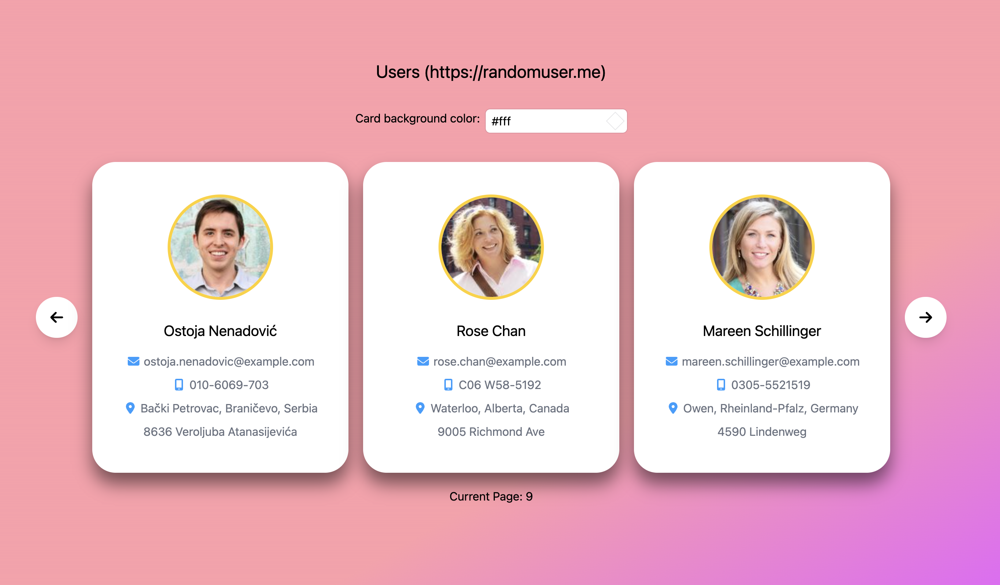

# https://randomuser.me Users Application

This project showcases a comprehensive example of a modern React application using several cutting-edge technologies and best practices in frontend development.

## Technologies Used

### React

Vast library and tool ecosystem with strong community support that I have strong experience with.

### Typescript

TypeScript is used to enhance JavaScript by adding static types, improving code quality, and catching errors at compile-time.

### Tanstack Query ⚡

Tanstack Query offloads so many concerns we normally have when fetching data like caching, loading states, graceful error handling and etc. In this project, React Query is used to manage server state and handle data fetching and caching for "user" data.

### MSW (Mock Service Worker) 🛠️

MSW is used for API mocking during testing. It intercepts network requests and provides mock responses, ensuring the tests are reliable and independent of external APIs.

### Vitest 🧪

Vite serves source code over native ESM and requires little configuration. Vitest is a blazing-fast unit test framework that runs in the Vite dev server.

### FontAwesome Icons 🎨

Enahnced the UI with visually appealing icons.

### Tailwind CSS 💅

Utility-first CSS classnames, proven in making it easy to create responsive and aesthetically pleasing user interfaces.

### Code formatting and linting 🧹

Prettier and ESLint are used to enforce consistent code formatting and maintain code quality.

### Node.js version discrepancies 💡

.nvmrc is used to specify the Node.js version for the project, ensuring that whoever runs the project use the same version for consistency.

## Key Decisions

1. **Compound Pattern**:
   The compound pattern is used in this React app to create flexible, reusable components and gives a nice way to express relationships between components. It allows for greater control over component composition and behavior by breaking down complex components into smaller, interchangeable parts.

2. **Tanstack Query for Data Fetching**:
   Paginating data is a highly efficient method to retrieve and display information, preventing the need to fetch and render extensive results simultaneously. Tanstack Query enhances performance by caching previously fetched data, thereby reducing the number of requests. Additionally, I prefetch the subsequent data before the "Next" pagination button is clicked, ensuring fast user experience.

3. **Error Handling and Skeleton Screens**:
   Error handling is implemented to gracefully manage and display error states. Skeleton screens are used to provide a better user experience during data loading phases, ensuring the UI remains responsive and visually consistent.

4. **Color Management**:
   The application includes dynamic color management for user cards, ensuring a customizable user interface. This is managed through a color input component and validated using utility functions. The color preference applies to all visible cards instantly. Upon changing the page you can select new color for the new chunk of user data.

5. **Color Selection and Current Page persistance**:
   'localStorage' is used to persist data on the client side, ensuring that color preferences and current page are retained even after the browser is closed.

6. **Testing with Vitest and MSW**:
   Comprehensive testing is implemented using Vitest and MSW. Vitest provides a fast and efficient way to run unit tests, while MSW allows for reliable API mocking, ensuring that tests are not dependent on external services.

## Available scripts

In the project you can run the following scripts:

- **`dev`**: Starts the development server using Vite.
- **`build`**: Compiles TypeScript and builds the project for production using Vite.
- **`test:watch`**: Runs tests in watch mode using Vitest.
- **`test`**: Runs all tests with coverage reporting using Vitest.
- **`watch:typescript`**: Watches for TypeScript changes and recompiles with preserved output.
- **`lint`**: Lints the codebase with ESLint, ensuring no unused directives and zero warnings.
- **`format`**: Checks code formatting according to Prettier rules.
- **`format:fix`**: Fixes code formatting issues and lists any remaining differences.
- **`preview`**: Previews the production build using Vite.

You made it up to here, congratulations! ... now go on and run the code to see it in action! 😊
